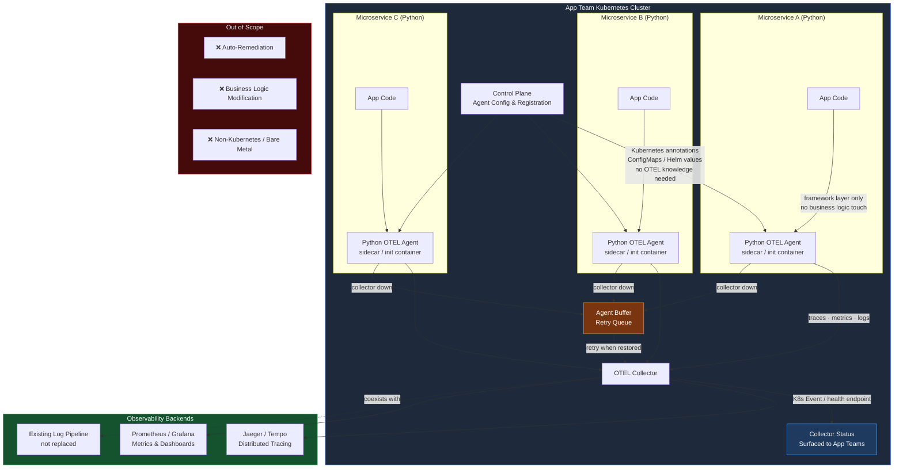

# System Flow — Python OTEL Agent Framework

## Flow Summary

| Step | What Happens | Constraint Enforced |
|------|-------------|---------------------|
| 1. App team configures agent | Via K8s annotations / ConfigMaps only | Zero OTEL knowledge required |
| 2. Control plane registers agent | Agent pulls config from control plane | Control plane required |
| 3. Agent instruments service | Framework/middleware layer only | No business logic modification |
| 4. Telemetry flows to collector | Traces, metrics, structured logs | Observe only — no remediation |
| 5. Collector goes down | Agent buffers and retries | Collector downtime must not crash services |
| 6. Outage surfaced | K8s Event or health endpoint | Collector connectivity surfaced to app teams |
| 7. Collector exports | To tracing, metrics backends | Existing log pipeline coexists, not replaced |
